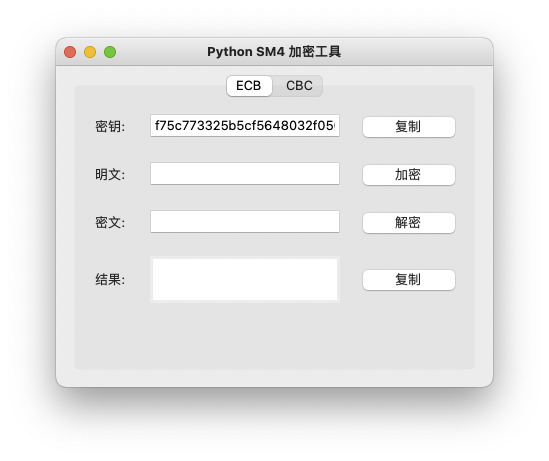
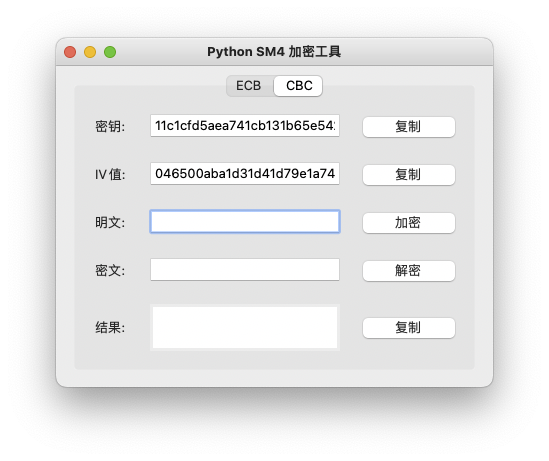

# 使用文档

### 工具 GUI 界面

### 工具使用说明

1. 密钥会随机生成 也可以自定义 （在CBC加密模式中，会有一个全局随机的IV值辅助加密，也可以自定义）
2. 输入需要加密的明文 -> 点击加密按钮在结果的窗口可得到加密的明文
3. 输入已经加密的密文 -> 点击解密按钮在结果的窗口可得到解密的明文
4. 记得保存密钥

### 使用工具

Mac OS:
git clone 本仓库
pip install -r requirements.txt
python AppGui.py

Linux:
git clone 本仓库
pip install -r requirements.txt
python AppGui.py

Windows:

[下载exe可执行文件](./OsFiles/AppGui.exe)

### 构建打包文件

git clone 本仓库

pip install -r requirements.txt

pip install pyinstaller

pyinstall -F -w AppGui.py
